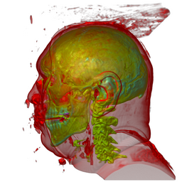
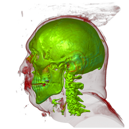

*Shengzhou Luo*
*罗胜舟*  
  
*[My CV](pdf/luo-cv.pdf)*  
*[PhD thesis](pdf/thesis.pdf)*  
*Member of Staff: scss_staff*  
*e-mail: luos at tcd dot ie*

******

## Summary

I am a research fellow at the [Graphics Vision Visualisation (GV2)](http://gv2.scss.tcd.ie/) lab in Trinity College Dublin, the University of Dublin.

My research areas include scientific visualization, transfer function optimization and intuitive volume visualization and exploration. My research focuses on volume visualization with automated optimization techniques for enhancing features of interest in volume rendered images, e.g. visibility and saliency metrics, and transfer function optimization based on the metrics.

Volume visualization is an effective means of discovering or analysing 3D features in volumetric data sets, which are ubiquitous in various fields of science, medicine and engineering. However, volume data sets are difficult to deal with due to their computational complexity as well as the information overload that can arise from such visually challenging data. My research in visibility and saliency metrics and automated optimization for volume visualization addresses this information overload problem.

I am currently working on the [ARTIVVIS (Real-time TIme-variant Volume VISualisation)](https://www.scss.tcd.ie/John.Dingliana/artivvis/) project, which addresses the problem of real-time interactive visualisation of scientific data, namely volumetric datasets, which are ubiquitous in many application domains such as Medicine, Biology, Fluid Dynamics and Veterinary Science.

Some of my open source projects:
[CUDA volume renderer with visibility measures](https://github.com/luosz/cuda-visibility),
[Volume Visualiser (VTK)](https://bitbucket.org/lsz/volume-visualiser),
[GPU volume ray-casting (OpenGL & GLSL)](https://github.com/luosz/volume-visualization/),
[AI Algorithm Platform (I implemented the pathfinding algorithms)](https://github.com/luosz/ai-algorithmplatform)

******

## Recent publications

* Shengzhou Luo, Subhrajyoti Maji and John Dingliana, “Intuitive Transfer Function Editing Using Relative Visibility Histograms”, in Journal of WSCG. Vol. 26(1), 2018. (Presented at WSCG International Conference in Central Europe on Computer Graphics, Visualization and Computer Vision, Plzen, Czech Republic, May 28 - June 1, 2018).
[pdf](pdf/wscg2018.pdf)

* Shengzhou Luo and John Dingliana, “Transfer Function Optimization Based on a Combined Model of Visibility and Saliency”, Spring Conference on Computer Graphics (SCCG), Mikulov, Czech Republic, 2017.
[pdf](pdf/sccg2017.pdf)
[video](video/vwsopt_video_h264format.mp4)

* Shengzhou Luo and John Dingliana, "Visibility-Weighted Saliency for Volume Visualization", Computer Graphics and Visual Computing (CGVC), London, UK, 2015.
[pdf](pdf/CGVC2015.pdf)

* Shengzhou Luo and John Dingliana, "Transfer Function Refinement for Exploring Volume Data", Eurasia Graphics 2014: International Conference on Computer Graphics, Animation and Gaming Technologies, Ankara, Turkey, 2014, p. 17.
[pdf](pdf/eurasia_graphics_2014.pdf)

* Shengzhou Luo and John Dingliana, "Information-Guided Transfer Function Refinement", Eurographics (Short Papers), Strasbourg, France, 2014, pp. 61-64.
[pdf](pdf/eg2014_short.pdf)
[doi](http://dx.doi.org/10.2312/egsh.20141015)
[BibTeX](luo_information-guided_2014.bib)

Before optimization | After optimization
------------- | -------------
 | 

A novel approach that optimizes transfer functions with a heuristic search algorithm in order to obtain better visibility of important features (the skull in the images) in volume visualization.

## Recent posters

* Shengzhou Luo and John Dingliana, "Intuitive Transfer Function Editing Using Relative Visibility Histograms ", IEEE Vis Posters, Phoenix Arizona, USA, 1-6 October, 2017.
[abstract](pdf/ieee_vis_2017_poster.pdf)
[poster](pdf/ieee_vis_2017_poster_by_John.pptx)
[video](video/ieee-vis2017-video-new-withsound-720p.mp4)

* Shengzhou Luo and John Dingliana, "Transfer Function Optimization Based on a Combined Model of Visibility and Saliency", EG / VGTC Conference on Visualization (EuroVis) 2016 Posters, Groningen, Netherlands, 6-10 June 2016. (Best Poster Award)
[pdf](pdf/poster1012_CRC.pdf)
[poster](pdf/poster1012.pdf)

Turbulent vortex | Statically optmize opacity | Dynamically optimize opacity
------------- | ------------- | -------------
 |  | 

* Michael Doyle, Shengzhou Luo and Michael Manzke, "Fast Hardware-Accelerated Construction of Spatial Index Structures for Visualization of Time-Varying Medical Data", MedViz and Visual Computing for Biology and Medicine Conference 2016, Bergen, Norway, 2016, pp. 79 - 81. (Poster)

* Shengzhou Luo and John Dingliana, "Selective Saturation and Brightness for Visualizing Time-Varying Volume Data", EuroVis 2015, Cagliari, Italy, poster presentation.
[pdf](pdf/eg2015poster.pdf)
[poster](pdf/Poster-4.pdf)

Hurricane Isabel with selective saturation and brightness |
------------- | -------------
 | 

******

## Other publications and posters

Shengzhou Luo, Xiao Li, Jianhuang Wu, and Xin Ma, "Importance-driven volume rendering and gradient peeling," in International Conference on Computer Graphics Theory and Applications (GRAPP), Vilamoura, Portugal, 2011, pp. 211-214, poster presentation.
[pdf](siat/GRAPP_2011_53_CR.pdf)

Shengzhou Luo, Jianhuang Wu, Xiao Li, and Xin Ma, "Orientation visualizing transfer function for volume rendering," in Proceedings of International Conference on Bioscience, Biochemistry and Bioinformatics (ICBBB), Singapore, 2011, pp. 88-92.
[pdf](siat/rp021_ICBBB2011-X00034.pdf)

Xiao Li, Shengzhou Luo, Jianhuang Wu, and Xin Ma, "Gradient vector and local distribution based volume visualization," in IEEE International Conference on Complex Medical Engineering (CME), Harbin, China, 2011, pp. 317-322.
[pdf](siat/xiao_li_cme_2011.pdf)

Xiao Li, Jianhuang Wu, Shengzhou Luo, and Xin Ma, "Boundary emphasis transfer function generation based on HSL color space," in International Conference on Graphic and Image Processing (ICGIP), Manila, Philippines, 2010, pp. 46-50.
[pdf](siat/xiao_li_icgip_2010.pdf)

Haifeng Wan, Yingpeng Zhang, Shengzhou Luo, Ruijie Liu, and Wensheng Ye, "The M2M pathfinding algorithm based on the idea of granular computing," in Proceedings of IEEE/WIC/ACM International Joint Conferences on Web Intelligence and Intelligent Agent Technologies (WI-IAT), Milan, Italy, 2009, pp. 533-540.
[pdf](siat/pathfinding_2009.pdf)

******

## Resources for scientific visualization

I wish I could have known these articles, websites and software earlier in my PhD study. These resources may be helpful for beginners in visualization research. For example, the datasets from IEEE Visualization Contest would be useful for understanding what problems are being studied in various visualization fields.

**LaTeX:**
[TCD thesis LaTeX template](download/TCD_Template.zip)
TCD Thesis Style File, version 2.0, March 2005, written by Dinesh Das, for Trinity College Dublin

**Articles:**

[The PhD in Visualization Starter Kit (Swansea University)](http://cs.swan.ac.uk/~csbob/research/starterKit/)  
[Delft Visualization Group Starter Kit (TU Delft)](http://www.vizworld.com/2010/10/delft-visualization-group-starter-kit/)

**Tutorials/Books/Courses:**

Real-Time Volume Graphics (Eurographics 2006) [tutorial](http://webdocs.cs.ualberta.ca/~pierreb/Visualization2006/Real-Time-Volume-Rendering.pdf) and [slides](http://www.real-time-volume-graphics.org/?page_id=28)  
[Wang, Chaoli; Shen, Han-Wei. Information Theory in Scientific Visualization. Entropy 2011, 13, 254-273.](http://www.mdpi.com/1099-4300/13/1/254/pdf)  
[Visual Computing for Medicine, Second Edition: Theory, Algorithms, and Applications](http://books.google.ie/books?id=saAYAAAAQBAJ&amp;printsec=frontcover#v=onepage&amp;q&amp;f=false)  
[Lighthouse3d Tutorials (OpenGL & GLSL)](http://www.lighthouse3d.com/tutorials/)  
[CUDA by Example: An Introduction to General-Purpose GPU Programming](http://www.physics.drexel.edu/~valliere/PHYS405/GPU_Story/CUDA_by_Example_Addison_Wesley_Jul_2010.pdf)  
[Open online courses in maths and computing](hpc.html)

**Data sets:**

Static:  
[The Volume Library](http://lgdv.cs.fau.de/External/vollib/),
[DICOM sample image sets](http://www.osirix-viewer.com/datasets/),
[3D Slicer sample data sets](http://www.slicer.org/slicerWiki/index.php/SampleData),
[CIBC Dataset Archive](http://www.sci.utah.edu/cibc-software/cibc-datasets.html),
[ImageVis3D data](http://www.sci.utah.edu/download/IV3DData.html),
[Seg3D data](https://github.com/CIBC-Internal/Seg3DData)  
[My collection of volume data sets from Internet](https://bitbucket.org/lsz/volume-data)

Time-varying:  
[Time-Varying Volume Data Repository](http://www.cs.ucdavis.edu/~ma/ITR/tvdr.html),
[IEEE Visualization Design Contests](http://sciviscontest-staging.ieeevis.org/)

**Software/libraries:**

[Mathematica](http://reference.wolfram.com/language/tutorial/VolumeRenderingAndProcessing.html),
[Voreen](http://voreen.uni-muenster.de/),
[Inviwo](http://www.inviwo.org/),
[3D Slicer](http://www.slicer.org/),
[VTK](http://www.vtk.org/),
[Processing](https://processing.org/)

******
<!---
Last modified: `r format(Sys.Date(), format="%A, %d %B %Y")`. This page is created using [R Markdown](http://rmarkdown.rstudio.com/).
-->
https://luosz.github.io/  
2019 Shengzhou Luo. All rights reserved.
